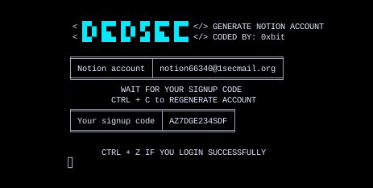

<h1 align="center"> DEDSEC NOTION AI <h1>

<h3 align="center">Use notion ai forever by generating account again and again </h3>

### METHOD

run the dedsec-notion.py and copy the account provided by tool and go to https://www.notion.so use the account to signup 
go back to the tool then copy the signup code then paste it to notion website

-------------------------------------------------------------------------------------------------------------------------------------------------------

### INSTALLATION 
* git clone https://github.com/0xbitx/Dedsec-Notion-Ai.git
* cd Dedsec-Notion-Ai
* python3 dedsec-notion.py

### TESTED ON FOLLOWING:-
* Kali Linux 
* Parrot OS 
* Ubuntu
* Termux

### LANGUAGE 
* python
 
<h1 align="center"> DISCLAIMER </h1>

<h4 align="center">I'm not responsible for anything you do with this program, so please only use it for good and educational purposes. </h4>
